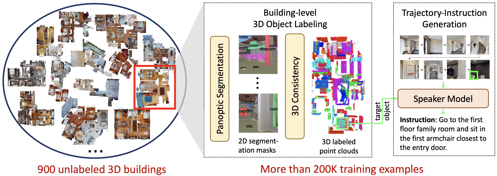

# Learning from Unlabeled 3D Environments for Vision-and-Language Navigation

This repository is the official implementation of [Learning from Unlabeled 3D Environments for Vision-and-Language Navigation](). 

Project webpage: [https://cshizhe.github.io/projects/hm3d_autovln.html](https://cshizhe.github.io/projects/hm3d_autovln.html).

In vision-and-language navigation (VLN), an embodied agent is required to navigate in realistic 3D environments following natural language instructions. One major bottleneck for existing VLN approaches is the lack of sufficient training data, resulting in unsatisfactory generalization to unseen environments. While VLN data is typically collected manually, such an approach is expensive and prevents scalability. In this work, we address the data scarcity issue by proposing to automatically create a large-scale VLN dataset from 900 unlabeled 3D buildings from HM3D. We generate a navigation graph for each building and transfer object predictions from 2D to generate pseudo 3D object labels by cross-view consistency. We then fine-tune a pretrained language model using pseudo object labels as prompts to alleviate the cross-modal gap in instruction generation. Our resulting HM3D-AutoVLN dataset is an order of magnitude larger than existing VLN datasets in terms of navigation environments and instructions. We experimentally demonstrate that HM3D-AutoVLN significantly increases the generalization ability of resulting VLN models. On the SPL metric, our approach improves over state of the art by 7.1% and 8.1% on the unseen validation splits of REVERIE and SOON datasets respectively.




## Requirements

1. Follow the installation instructions in [DUET](https://github.com/cshizhe/VLN-DUET) to setup the environment.

2. Download the [HM3D-AutoVLN](https://www.dropbox.com/sh/6it95wkn20mnyou/AAABNp0scXpflBsq00JFg5QNa?dl=0) dataset or follow the [instructions](README_DATA.md) to automatically create the HM3D-AutoVLN dataset.

3. Download the [processed data and trained models](https://www.dropbox.com/sh/789nuoo93bpsk48/AAAVzZJrrSu7IpRyQtOGX2sca?dl=0) for downstream REVERIE and SOON tasks.


## Pretraining

Combine behavior cloning and auxiliary proxy tasks in pretraining:
```pretrain
cd pretrain_src

outdir=../datasets/REVERIE/expr_duet/pretrain_hm3d_v1/test
python train_hm3d_reverie.py --world_size 1 --vlnbert cmt \
    --model_config config/hm3d_reverie_obj_model_config.json \
    --config config/hm3d_reverie_obj_pretrain.json \
    --output_dir $outdir
```

## Fine-tuning & Evaluation

Use pseudo interative demonstrator to fine-tune the model:
```finetune
cd map_nav_src
bash scripts/run_reverie.sh # (run_soon.sh)
```
